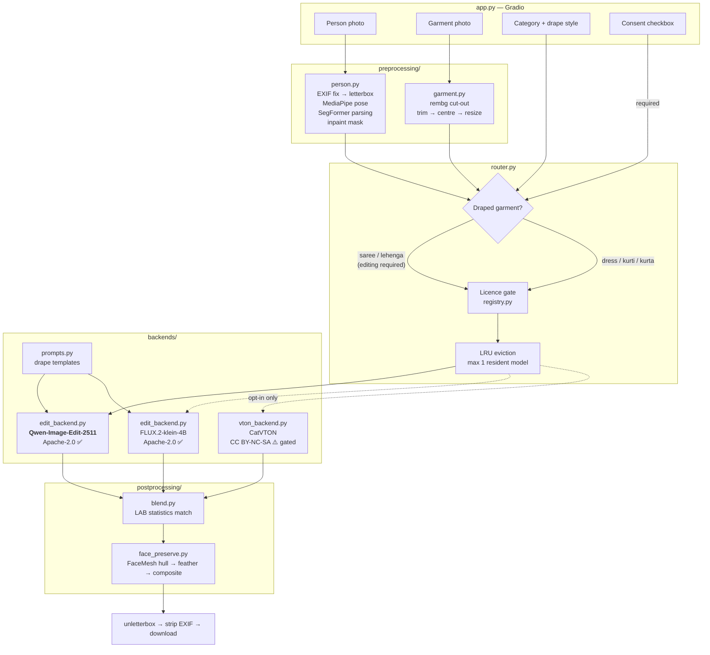

# AI Trial Room

**Virtual try-on built for Indian wear** — dresses, kurtis, kurtas, sarees and lehengas.

Upload a photo of a person and a photo of a garment, pick a category, and get a
photorealistic image of that person wearing it — with their face, body shape,
pose and background preserved.

> **Built on Apache-2.0 models only.** Every model in the default configuration
> is permissively licensed, so this can be deployed as a commercial product for
> retail shops. See [Licensing](#licensing) — this is the section that matters
> most, and it is the reason the architecture looks the way it does.

---

## Table of contents

- [Why the obvious approach doesn't work](#why-the-obvious-approach-doesnt-work)
- [Architecture](#architecture)
- [Setup](#setup)
- [Usage](#usage)
- [Configuration](#configuration)
- [Performance](#performance)
- [Licensing](#licensing)
- [Privacy](#privacy)
- [Known limitations](#known-limitations)
- [Roadmap](#roadmap)
- [Credits](#credits)

---

## Why the obvious approach doesn't work

The standard answer to "build a virtual try-on" is a **garment-warping** model —
IDM-VTON, CatVTON, OOTDiffusion. They are excellent, and for this project they
are the wrong tool, for two independent reasons.

### 1. A saree is not a garment you can warp

Warping models learn a correspondence from a flat garment image to a body
region: find the torso, deform the garment to fit it, blend. That works because
a T-shirt has a fixed two-dimensional cut — sleeves, shoulder seams, a hem.

A saree is a single **5–9 metre rectangle of unstitched cloth**. It has no
sleeves, no seams, and no fixed shape. Its final form exists *only* as a
function of how it is wrapped — pleats tucked at the waist, pallu carried over a
shoulder, and a different result entirely depending on whether the drape is Nivi
or Nauvari. There is no flat-garment-to-body correspondence to learn, so there
is nothing for a warping model to warp.

**Reference-based image editing** can do it, because the drape is described in
language and *synthesised*, not transformed. That is why this project's prompt
templates name pleats, pallu, choli and dupatta explicitly — naming a component
is what makes the model render it.

### 2. Every warping model is non-commercially licensed

| Model | Licence | Sellable? |
|---|---|---|
| [IDM-VTON](https://github.com/yisol/IDM-VTON) | CC BY-NC-SA 4.0 | ❌ |
| [CatVTON](https://github.com/Zheng-Chong/CatVTON) | CC BY-NC-SA 4.0 | ❌ |
| [OOTDiffusion](https://github.com/levihsu/OOTDiffusion) | CC BY-NC-SA 4.0 | ❌ |
| [FLUX.1 Kontext dev](https://huggingface.co/black-forest-labs/FLUX.1-Kontext-dev) | BFL Non-Commercial | ❌ |

As of this writing there is **no permissively licensed garment-warping try-on
model**. A product built on any of the above cannot legally be sold.

So the production path is reference editing, and the license gate is enforced in
code — see [`backends/base.py`](ai_trial_room/backends/base.py)
(`check_license`). CatVTON is still included as a *research-only* quality
baseline, hard-blocked unless you export `ALLOW_NONCOMMERCIAL=1`.

---

## Architecture



### Module map

| Path | Responsibility |
|---|---|
| [`config.py`](ai_trial_room/config.py) | Every setting, all env-overridable. Model specs with licence class. |
| [`preprocessing/person.py`](ai_trial_room/preprocessing/person.py) | Letterbox, MediaPipe pose, SegFormer parsing, per-category inpaint mask. |
| [`preprocessing/garment.py`](ai_trial_room/preprocessing/garment.py) | rembg background removal, alpha trim, centre, resize. |
| [`backends/base.py`](ai_trial_room/backends/base.py) | `TryOnBackend` ABC. Lazy load, licence gate, OOM translation, memory savers. |
| [`backends/prompts.py`](ai_trial_room/backends/prompts.py) | Drape-specific prompt templates. **The Indian-wear specialisation lives here.** |
| [`backends/edit_backend.py`](ai_trial_room/backends/edit_backend.py) | Qwen-Image-Edit + FLUX.2 klein. Nunchaku INT4, FP8 casting. |
| [`backends/vton_backend.py`](ai_trial_room/backends/vton_backend.py) | CatVTON, research-gated. |
| [`backends/registry.py`](ai_trial_room/backends/registry.py) | LRU eviction so two heavy models never co-reside. |
| [`router.py`](ai_trial_room/router.py) | Backend selection + the end-to-end pipeline. |
| [`postprocessing/face_preserve.py`](ai_trial_room/postprocessing/face_preserve.py) | FaceMesh hull → feathered composite, with drift guard. |
| [`postprocessing/blend.py`](ai_trial_room/postprocessing/blend.py) | LAB colour/lighting match, selective sharpening. |
| [`app.py`](app.py) | Gradio UI. |

### Two design decisions worth calling out

**Letterbox, never crop.** Cropping a portrait photo to a fixed aspect ratio
cuts off the hem of a saree or lehenga — exactly the part the customer is buying.
[`letterbox`](ai_trial_room/utils/image_io.py) pads instead, and
`unletterbox` returns the result at the resolution the customer uploaded.

**The saree mask includes the legs.** Human parsing labels only *existing*
clothing. Someone wearing jeans has zero pixels labelled `SKIRT`, so a naive
mask leaves denim showing under the drape.
[`_draped_extension_mask`](ai_trial_room/preprocessing/person.py) adds a
trapezoid flaring from the hips to the bottom of the frame. This is covered by
`test_saree_mask_covers_legs_but_kurti_mask_does_not`.

---

## Setup

### Requirements

- Python 3.10–3.12
- NVIDIA GPU, 8 GB VRAM minimum (16 GB recommended)
- ~25 GB free disk for model weights

### 1. Install PyTorch for *your* GPU first

This must match your architecture, so it is not pinned in `requirements.txt`:

```bash
# Kaggle / Colab T4, RTX 30xx / 40xx  (CUDA 12.4)
pip install torch==2.6.0 --index-url https://download.pytorch.org/whl/cu124
```

```bash
# RTX 50-series (Blackwell, sm_120) — needs CUDA 12.8+
pip install torch --index-url https://download.pytorch.org/whl/cu128
```

Verify:

```bash
python -c "import torch; print(torch.__version__, torch.cuda.is_available())"
```

### 2. Install the rest

```bash
pip install -r requirements.txt
```

### 3. Set your token (optional but recommended)

```bash
cp .env.example .env    # then edit it
```

Tokens are read from the environment only — `HF_TOKEN` is never written to code
or committed.

### 4. Verify without downloading any weights

```bash
python tests/test_core.py
```

### 5. Run

```bash
python app.py
```

Opens on <http://localhost:7860>. Add `--share` for a public link.

### Kaggle / Colab

Open [`notebooks/run_on_kaggle.ipynb`](notebooks/run_on_kaggle.ipynb) and run
the cells top to bottom. It installs dependencies, verifies the GPU, runs the
test suite and launches with a public link.

### Optional: Nunchaku INT4 (large VRAM saving)

Shrinks the 12 B Qwen transformer from ~40 GB (bf16) to ~7 GB, and to **3–4 GB**
with async CPU offload. Wheels are per (Python, PyTorch) pair — grab yours from
[the releases page](https://github.com/nunchaku-tech/nunchaku/releases). The app
detects it automatically and falls back to bf16 + CPU offload when absent.

### Optional: CatVTON baseline (research only)

```bash
git clone https://github.com/Zheng-Chong/CatVTON third_party/CatVTON
export AITR_CATVTON_PATH=third_party/CatVTON
export ALLOW_NONCOMMERCIAL=1
```

⚠️ **Do not sell anything produced this way** — CatVTON is CC BY-NC-SA 4.0.

---

## Usage

### Web UI

1. Upload a person photo and a garment photo.
2. Pick a category. For **Saree**, a drape-style dropdown appears.
3. Tick the consent checkbox — the Generate button stays disabled until you do.
4. Generate. Results appear as a single image and as a before/after strip, with
   a download button.

### Python API

```python
from ai_trial_room.backends.base import TryOnOptions
from ai_trial_room.config import Category, DrapeStyle
from ai_trial_room.router import run_try_on

report = run_try_on(
    "customer.jpg",
    "saree_catalogue_0421.jpg",
    Category.SAREE,
    options=TryOnOptions(
        steps=40,
        drape_style=DrapeStyle.GUJARATI,
        seed=12345,
    ),
    consent=True,          # you assert you have the right to use the photo
)

report.after.save("result.png")
print(report.caption())    # model, seed, per-stage timings, licence
```

### Comparison grids (for a LinkedIn post)

Every permitted backend, same inputs, same seed:

```bash
python scripts/compare_backends.py --person p.jpg --garment s.jpg --category saree
```

All four saree drapes through one model — the image that actually shows the
specialisation:

```bash
python scripts/compare_backends.py --person p.jpg --garment s.jpg --category saree --sweep-drapes
```

Writes a labelled PNG plus a JSON sidecar of timings and prompts to `outputs/`.

---

## Configuration

Everything lives in [`config.py`](ai_trial_room/config.py) and is
environment-overridable.

| Variable | Default | Purpose |
|---|---|---|
| `HF_TOKEN` | — | Hugging Face token. **Never hardcode.** |
| `AITR_WIDTH` / `AITR_HEIGHT` | `768` / `1024` | Working resolution. |
| `AITR_DTYPE` | `auto` | `bfloat16` on Ampere+, `float16` on T4. |
| `AITR_QUANTIZE` | `auto` | `int4` under 15 GB, `fp8` to 20 GB, else `none`. |
| `AITR_MODEL_CPU_OFFLOAD` | `1` | Offload submodules between steps. |
| `AITR_SEQ_CPU_OFFLOAD` | `0` | More aggressive; use under 8 GB. |
| `AITR_ATTENTION_SLICING` | `1` | Chunk attention to cut peak memory. |
| `AITR_VAE_TILING` | `1` | Tile VAE decode for high resolution. |
| `AITR_MAX_RESIDENT_BACKENDS` | `1` | Heavy models allowed in VRAM at once. |
| `AITR_STEPS` | `30` | Default inference steps. |
| `AITR_TRUE_CFG` | `4.0` | Default true CFG scale. |
| `ALLOW_NONCOMMERCIAL` | `0` | **Leave at 0 for a product you sell.** |
| `AITR_SHARE` | `0` | Create a public Gradio link. |
| `AITR_PORT` | `7860` | Server port. |

---

## Performance

Measured at 768×1024, 30 steps, single image.

| GPU | VRAM | Config | Qwen-Image-Edit | FLUX.2 klein 4B |
|---|---|---|---|---|
| T4 (Kaggle/Colab) | 16 GB | fp16 + model offload | ~90–120 s | ~40–55 s |
| T4 + Nunchaku INT4 | 16 GB | int4 + async offload | ~55–75 s | — |
| RTX 4090 | 24 GB | bf16, resident | ~20–28 s | ~9–13 s |
| RTX 5050 laptop | 8 GB | int4 + sequential offload | ~150–200 s | ~70–90 s |

Memory techniques applied, in
[`_apply_memory_savers`](ai_trial_room/backends/base.py):

- fp16 on Turing, bf16 on Ampere and newer (auto-detected)
- Nunchaku SVDQuant INT4/FP4 when installed, FP8 cast on sm_89+, else bf16
- model CPU offload (or sequential offload on small cards)
- attention slicing, VAE slicing, VAE tiling
- **LRU eviction** — at most one heavy backend resident, enforced in
  [`registry.py`](ai_trial_room/backends/registry.py)
- lazy loading: no weights touch the GPU until the first generation

OOM is caught, the backend is unloaded, and the user is told to lower steps or
resolution rather than shown a traceback.

---

## Licensing

### Models used by default — all commercially usable

| Model | Licence | Commercial | VRAM (bf16) | Role |
|---|---|---|---|---|
| [`Qwen/Qwen-Image-Edit-2511`](https://huggingface.co/Qwen/Qwen-Image-Edit-2511) | Apache-2.0 | ✅ | ~16 GB | Primary, all categories |
| [`black-forest-labs/FLUX.2-klein-4B`](https://huggingface.co/black-forest-labs/FLUX.2-klein-4B) | Apache-2.0 | ✅ | ~13 GB | Fast tier |
| [MediaPipe](https://github.com/google-ai-edge/mediapipe) Pose + FaceMesh | Apache-2.0 | ✅ | CPU | Pose, face preservation |
| [rembg](https://github.com/danielgatis/rembg) + u2net | MIT | ✅ | CPU | Garment background removal |

### Gated behind `ALLOW_NONCOMMERCIAL=1`

| Model | Licence | Commercial |
|---|---|---|
| [CatVTON](https://github.com/Zheng-Chong/CatVTON) | CC BY-NC-SA 4.0 | ❌ Research only |

### ⚠️ One dependency needs your attention before you sell

[`mattmdjaga/segformer_b2_clothes`](https://huggingface.co/mattmdjaga/segformer_b2_clothes)
(human parsing) inherits the **NVIDIA Source Code License** for SegFormer, which
is research-only. It builds the inpaint mask.

Three ways to resolve it:

1. **Drop it.** `parse_human` already degrades gracefully to a pose-derived
   fallback mask (`test_mask_falls_back_when_parsing_unavailable` covers this).
   Quality drops on complex poses.
2. **Retrain the head.** The SegFormer *architecture* is permissive; the
   *weights* are the problem. Fine-tune on a commercially licensed parsing
   dataset.
3. **License it.** Buy a commercial human-parsing model.

I have deliberately not papered over this. If you are selling to shops, resolve
it before you invoice anyone.

### Also worth knowing

- **InsightFace is avoided on purpose.** It is the usual choice for face
  preservation, and its models are non-commercial. This project uses MediaPipe
  FaceMesh instead.
- **BRIA RMBG-2.0 is avoided on purpose.** Better background removal than u2net,
  but requires a paid commercial agreement.

Model licences govern the *weights*, independent of this repository's own code
licence. Always read the model card before shipping.

---

## Privacy

Uploaded photos are biometric data. What this app does about it:

- **Never persisted.** Processing is in memory; the download file is written to a
  directory that `ephemeral_dir` force-deletes when the request ends — including
  when it raises (`test_ephemeral_dir_is_purged_even_on_error`).
- **EXIF stripped.** `scrub_metadata` removes GPS coordinates and device IDs, so
  a downloaded result cannot leak where the photo was taken.
- **Consent is structural.** The Generate button is disabled until the checkbox
  is ticked, and `run_try_on` re-checks `consent` — so scripts and any future API
  cannot bypass it.
- **No image logging.** Logs contain sizes, timings and decisions. Never pixels.
- **Tokens from the environment only.**

---

## Known limitations

Stated plainly, because a demo that hides these wastes the buyer's time.

| Limitation | Detail |
|---|---|
| Nauvari drapes are unreliable | Dhoti-style nine-yard drapes have thin training representation. Phase 3's LoRA targets this. |
| Heavy occlusion confuses the mask | Arms folded across the torso, or a held handbag, break garment parsing. |
| Fine zari and mirror work softens | Diffusion output loses sub-pixel metallic thread. Raise steps; `sharpen_garment_region` helps. |
| Seated and turned poses degrade | Standing, front-facing is markedly more reliable. |
| Full-length photo required for draped garments | Enforced by `require_framing` — a hallucinated lower body will not match the customer. |
| Print *placement* can drift | Colour and motif transfer well; exact border geometry may shift. Warping models are better here, which is what the comparison grid shows. |
| No multi-garment layering | One garment per generation. |
| Not a fit predictor | This visualises drape and colour. It does not tell a customer their size. |
| Skin-tone fidelity | Colour harmonization defends against drift, but verify across a range of skin tones before deploying to shops. |

---

## Roadmap

- **Phase 1 — done.** Structure, preprocessing, both commercial backends,
  licence-aware router, face preservation, colour harmonization, Gradio UI,
  Kaggle notebook, comparison script, 31 tests.
- **Phase 2.** Saree/lehenga polish: per-drape negative prompts, pallu-region
  refinement pass, stronger identity preservation, batch mode for catalogues.
- **Phase 3.** LoRA fine-tuning for sarees: dataset layout, captioning helper,
  T4-tuned training script, LoRA loading in `edit_backend.py`.
- **Phase 4.** Hugging Face Spaces deployment: Space config, ZeroGPU, README
  card.

Shop-deployment items beyond the original scope, worth planning for: catalogue
batch processing, a REST API with job queue, per-tenant branding, usage metering,
and an output audit log for disputes.

---

## Credits

| Component | Authors |
|---|---|
| Qwen-Image-Edit | Alibaba Qwen team |
| FLUX.2 klein | Black Forest Labs |
| CatVTON | Zheng Chong et al., ICLR 2025 |
| MediaPipe | Google |
| SegFormer | NVIDIA · ATR fine-tune by mattmdjaga |
| rembg / u2net | Daniel Gatis · Xuebin Qin et al. |
| diffusers, transformers | Hugging Face |

Built as a portfolio project. The code in this repository is yours to adapt;
the model weights are governed by their own licences, listed above.
