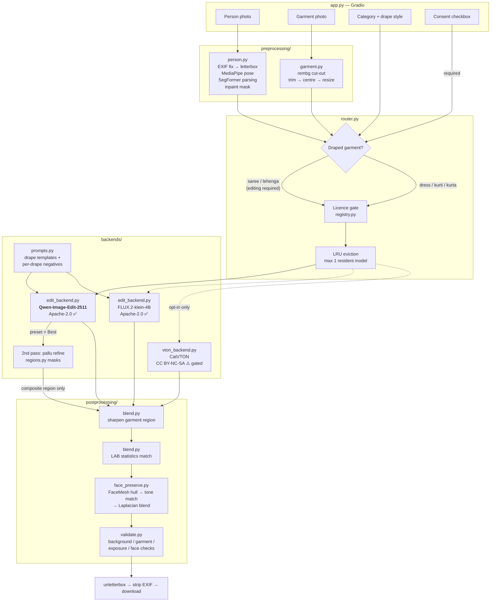

# AI Trial Room

**Virtual try-on built for Indian wear** — dresses, kurtis, kurtas, sarees and lehengas.

Upload a photo of a person and a photo of a garment, pick a category, and get a
photorealistic image of that person wearing it — with their face, body shape,
pose and background preserved.

> **Built on Apache-2.0 models only.** Every model in the default configuration
> is permissively licensed, so this can be deployed as a commercial product for
> retail shops. See [Licensing](#licensing) — this is the section that matters
> most, and it is the reason the architecture looks the way it does.

---

## Table of contents

- [Why the obvious approach doesn't work](#why-the-obvious-approach-doesnt-work)
- [Architecture](#architecture)
- [Setup](#setup)
- [Usage](#usage)
- [Configuration](#configuration)
- [Performance](#performance)
- [Licensing](#licensing)
- [Privacy](#privacy)
- [Known limitations](#known-limitations)
- [Roadmap](#roadmap)
- [Credits](#credits)

---

## Why the obvious approach doesn't work

The standard answer to "build a virtual try-on" is a **garment-warping** model —
IDM-VTON, CatVTON, OOTDiffusion. They are excellent, and for this project they
are the wrong tool, for two independent reasons.

### 1. A saree is not a garment you can warp

Warping models learn a correspondence from a flat garment image to a body
region: find the torso, deform the garment to fit it, blend. That works because
a T-shirt has a fixed two-dimensional cut — sleeves, shoulder seams, a hem.

A saree is a single **5–9 metre rectangle of unstitched cloth**. It has no
sleeves, no seams, and no fixed shape. Its final form exists *only* as a
function of how it is wrapped — pleats tucked at the waist, pallu carried over a
shoulder, and a different result entirely depending on whether the drape is Nivi
or Nauvari. There is no flat-garment-to-body correspondence to learn, so there
is nothing for a warping model to warp.

**Reference-based image editing** can do it, because the drape is described in
language and *synthesised*, not transformed. That is why this project's prompt
templates name pleats, pallu, choli and dupatta explicitly — naming a component
is what makes the model render it.

### 2. Every warping model is non-commercially licensed

| Model | Licence | Sellable? |
|---|---|---|
| [IDM-VTON](https://github.com/yisol/IDM-VTON) | CC BY-NC-SA 4.0 | ❌ |
| [CatVTON](https://github.com/Zheng-Chong/CatVTON) | CC BY-NC-SA 4.0 | ❌ |
| [OOTDiffusion](https://github.com/levihsu/OOTDiffusion) | CC BY-NC-SA 4.0 | ❌ |
| [FLUX.1 Kontext dev](https://huggingface.co/black-forest-labs/FLUX.1-Kontext-dev) | BFL Non-Commercial | ❌ |

As of this writing there is **no permissively licensed garment-warping try-on
model**. A product built on any of the above cannot legally be sold.

So the production path is reference editing, and the license gate is enforced in
code — see [`backends/base.py`](ai_trial_room/backends/base.py)
(`check_license`). CatVTON is still included as a *research-only* quality
baseline, hard-blocked unless you export `ALLOW_NONCOMMERCIAL=1`.

---

## Architecture



### Module map

| Path | Responsibility |
|---|---|
| [`config.py`](ai_trial_room/config.py) | Every setting, all env-overridable. Model specs with licence class. |
| [`preprocessing/person.py`](ai_trial_room/preprocessing/person.py) | Letterbox, MediaPipe pose, SegFormer parsing, per-category inpaint mask. |
| [`preprocessing/garment.py`](ai_trial_room/preprocessing/garment.py) | rembg background removal, alpha trim, centre, resize. |
| [`preprocessing/parsing.py`](ai_trial_room/preprocessing/parsing.py) | Licence-aware human parsing; MediaPipe default, pose-split coarse classes. |
| [`spaces_support.py`](ai_trial_room/spaces_support.py) | ZeroGPU decorator, duration estimation, Space config overrides. |
| [`preprocessing/regions.py`](ai_trial_room/preprocessing/regions.py) | Pallu / pleat / blouse / skirt sub-region masks from pose geometry. |
| [`backends/base.py`](ai_trial_room/backends/base.py) | `TryOnBackend` ABC. Lazy load, licence gate, OOM translation, memory savers, quality presets. |
| [`backends/prompts.py`](ai_trial_room/backends/prompts.py) | Drape templates + per-drape negative prompts. **The Indian-wear specialisation lives here.** |
| [`backends/edit_backend.py`](ai_trial_room/backends/edit_backend.py) | Qwen-Image-Edit + FLUX.2 klein. Nunchaku INT4, FP8, region refinement pass. |
| [`backends/vton_backend.py`](ai_trial_room/backends/vton_backend.py) | CatVTON, research-gated. |
| [`backends/registry.py`](ai_trial_room/backends/registry.py) | LRU eviction so two heavy models never co-reside. |
| [`router.py`](ai_trial_room/router.py) | Backend selection + the end-to-end pipeline. |
| [`postprocessing/face_preserve.py`](ai_trial_room/postprocessing/face_preserve.py) | FaceMesh hull → tone match → Laplacian blend, with drift guard. |
| [`postprocessing/blend.py`](ai_trial_room/postprocessing/blend.py) | LAB colour match, Laplacian pyramid blending, selective sharpening. |
| [`postprocessing/validate.py`](ai_trial_room/postprocessing/validate.py) | Output quality checks that flag results needing a human look. |
| [`lora.py`](ai_trial_room/lora.py) | Adapter discovery, compatibility gating, trigger insertion, loading. |
| [`training/dataset.py`](ai_trial_room/training/dataset.py) | `drape` and `paired` dataset layouts, scanning and validation. |
| [`training/caption.py`](ai_trial_room/training/caption.py) | Template and VLM captioning, aligned to the inference vocabulary. |
| [`training/train_lora.py`](ai_trial_room/training/train_lora.py) | Flow-matching LoRA trainer with hardware-aware defaults. |
| [`app.py`](app.py) | Gradio UI. |

### Design decisions worth calling out

**Letterbox, never crop.** Cropping a portrait photo to a fixed aspect ratio
cuts off the hem of a saree or lehenga — exactly the part the customer is buying.
[`letterbox`](ai_trial_room/utils/image_io.py) pads instead, and
`unletterbox` returns the result at the resolution the customer uploaded.

**The saree mask includes the legs.** Human parsing labels only *existing*
clothing. Someone wearing jeans has zero pixels labelled `SKIRT`, so a naive
mask leaves denim showing under the drape.
[`_draped_extension_mask`](ai_trial_room/preprocessing/person.py) adds a
trapezoid flaring from the hips to the bottom of the frame. This is covered by
`test_saree_mask_covers_legs_but_kurti_mask_does_not`.

**Negative prompts name the specific wrong drape, not generic quality terms.**
Piling on "ugly, bad anatomy, worst quality" does almost nothing. What works is
naming the exact thing the model collapses into: a Gujarati *seedha pallu*
negative says `pallu over the left shoulder, pallu hanging down the back`,
because that is the Nivi drape it defaults to. Nauvari's says `straight skirt,
legs joined together under the fabric`, because a dhoti-style drape is the one
it cannot do. See [`build_negative_prompt`](ai_trial_room/backends/prompts.py).

**The pallu is a band, not a panel.** The refinement mask runs along the
shoulder-to-opposite-hip axis at roughly a third of torso width
([`_pallu_polygon`](ai_trial_room/preprocessing/regions.py)). A mask covering
the whole chest would let the second denoise pass alter the blouse and the
silhouette — the two things refinement must never touch.

**Identity blending is a Laplacian pyramid, not an alpha composite.** A plain
feathered paste blends every spatial frequency at the same rate, so the wide
feather needed to hide the seam also cross-fades facial detail, while a narrow
feather leaves a visible patch edge — and there *will* be an edge, because the
model relit the person. A Laplacian blend cross-fades lighting gradually while
switching fine detail sharply, so the face stays crisp and the join disappears.
`test_laplacian_blend_preserves_high_frequency_detail` pins this: reconstruction
error through a full mask is 0.00/255.

---

## Setup

### Requirements

- Python 3.10–3.12
- NVIDIA GPU, 8 GB VRAM minimum (16 GB recommended)
- ~25 GB free disk for model weights

### 1. Install PyTorch for *your* GPU first

This must match your architecture, so it is not pinned in `requirements.txt`:

```bash
# Kaggle / Colab T4, RTX 30xx / 40xx  (CUDA 12.4)
pip install torch==2.6.0 --index-url https://download.pytorch.org/whl/cu124
```

```bash
# RTX 50-series (Blackwell, sm_120) — needs CUDA 12.8+
pip install torch --index-url https://download.pytorch.org/whl/cu128
```

Verify:

```bash
python -c "import torch; print(torch.__version__, torch.cuda.is_available())"
```

### 2. Install the rest

```bash
pip install -r requirements.txt
```

### 3. Set your token (optional but recommended)

```bash
cp .env.example .env    # then edit it
```

Tokens are read from the environment only — `HF_TOKEN` is never written to code
or committed.

### 4. Verify without downloading any weights

```bash
python tests/test_core.py
```

### 5. Run

```bash
python app.py
```

Opens on <http://localhost:7860>. Add `--share` for a public link.

### Kaggle / Colab

Open [`notebooks/run_on_kaggle.ipynb`](notebooks/run_on_kaggle.ipynb) and run
the cells top to bottom. It installs dependencies, verifies the GPU, runs the
test suite and launches with a public link.

### Optional: Nunchaku INT4 (large VRAM saving)

Shrinks the 12 B Qwen transformer from ~40 GB (bf16) to ~7 GB, and to **3–4 GB**
with async CPU offload. Wheels are per (Python, PyTorch) pair — grab yours from
[the releases page](https://github.com/nunchaku-tech/nunchaku/releases). The app
detects it automatically and falls back to bf16 + CPU offload when absent.

### Optional: CatVTON baseline (research only)

```bash
git clone https://github.com/Zheng-Chong/CatVTON third_party/CatVTON
export AITR_CATVTON_PATH=third_party/CatVTON
export ALLOW_NONCOMMERCIAL=1
```

⚠️ **Do not sell anything produced this way** — CatVTON is CC BY-NC-SA 4.0.

---

## Usage

### Web UI

1. Upload a person photo and a garment photo.
2. Pick a category. **Saree** reveals a drape-style dropdown, **Lehenga** a
   dupatta-style dropdown.
3. Pick a quality preset — **Fast**, **Balanced** or **Best**. A salesperson
   never has to think about step counts.
4. Tick the consent checkbox — the Generate button stays disabled until you do.
5. Generate. Results appear as a single image and as a before/after strip, with a
   download button and any quality warnings.

#### Quality presets

| Preset | Steps | Refines pallu | Typical T4 time |
|---|---|---|---|
| Fast | 20 | no | ~1 min |
| Balanced | 30 | no | ~2 min |
| Best | 40 | **yes** (+24 steps) | ~4 min |

**Best** runs a second, region-targeted pass over the pallu / dupatta. Because
`QwenImageEditPlusPipeline` takes no mask, that pass re-runs the model using the
*first-pass output* as reference 1 with a detail-only prompt, then composites
**only** the pallu band back through its feathered mask. Everything outside the
band is bit-identical to the first pass, so a bad refinement can only degrade the
region it aimed at — never the face, background or silhouette.

#### Quality warnings

Every result is checked and flagged rather than silently shipped:

| Code | Means |
|---|---|
| `garment_unchanged` | The model ignored the garment — the worst failure, because it looks like success |
| `background_drift` | The backdrop was repainted too |
| `exposure_drift` | The result is much brighter or darker than the source |
| `face_missing` | No face detectable in the output |
| `partial_framing` | *Info only* — lower drape inferred because the photo is not full length |

Nothing is ever rejected. A flagged image an operator can judge beats a refusal.

### Python API

```python
from ai_trial_room.backends.base import TryOnOptions
from ai_trial_room.config import Category, DrapeStyle
from ai_trial_room.router import run_try_on

from ai_trial_room.config import QualityPreset

report = run_try_on(
    "customer.jpg",
    "saree_catalogue_0421.jpg",
    Category.SAREE,
    options=TryOnOptions.from_preset(
        QualityPreset.BEST,          # 40 steps + pallu refinement
        drape_style=DrapeStyle.GUJARATI,
        seed=12345,
    ),
    consent=True,          # you assert you have the right to use the photo
)

report.after.save("result.png")
print(report.caption())              # model, seed, timings, licence, warnings

if not report.validation.ok:
    for finding in report.validation.warnings:
        print(f"{finding.code}: {finding.message}")
```

### Catalogue batch mode

The feature a shop actually buys: one model photo, a folder of garments, every
combination rendered overnight.

```bash
python scripts/batch_catalogue.py --person models/priya.jpg --garments catalogue/sarees --category saree
```

All four drapes for every saree, for a lookbook:

```bash
python scripts/batch_catalogue.py --person models/priya.jpg --garments catalogue/sarees --category saree --all-drapes --preset best
```

Check the job count before committing a GPU night to it:

```bash
python scripts/batch_catalogue.py --persons models/ --garments catalogue/sarees --category saree --dry-run
```

Outputs, under `outputs/catalogue-<category>-<timestamp>/`:

| Path | Contents |
|---|---|
| `images/<person>__<garment>__<drape>.jpg` | One render per combination |
| `manifest.csv` | Row per job: inputs, settings, seed, timings, **validation findings** |
| `contact_sheet_NN.jpg` | Thumbnail grids for quick review |

`manifest.csv` is what makes a 400-image run reviewable — sort by
`validation_ok` and look only at what got flagged. A single bad photo never kills
the run: it is recorded as `failed` and the batch continues. `--resume` skips
outputs that already exist, so an interrupted overnight run picks up where it
stopped.

### Training a drape LoRA

The base models drape a Nivi saree competently and a Nauvari one badly. A LoRA
trained on your own correctly-draped photos is the fix. Full dataset guide:
[`datasets/README.md`](datasets/README.md).

```bash
python scripts/caption_dataset.py --dataset datasets/saree_drapes
```

```bash
python scripts/train_saree_lora.py --dataset datasets/saree_drapes --dry-run
```

```bash
python scripts/train_saree_lora.py --dataset datasets/saree_drapes --name saree-drape-v1
```

The adapter lands in `loras/saree-drape-v1/` and appears in the UI's **Drape
LoRA** dropdown on next start. `apply_trigger` inserts the trigger token
(`aitrsaree`) into the prompt automatically — forgetting it is the usual reason a
fresh LoRA appears to do nothing.

#### Which base model can you actually train?

| Base | Params | Practical minimum | On a 16 GB T4 |
|---|---|---|---|
| `FLUX.2-klein-4B` | 4 B | 16 GB | ✅ **Default target** |
| `Qwen-Image-Edit-2511` | 12 B | 24 GB | ⚠️ Marginal — needs 4-bit + 512 px |

`default_config` reads your VRAM and picks for you; `--dry-run` prints the
resolved plan plus warnings. Both bases are Apache-2.0, so either adapter is
yours to sell.

#### Two dataset modes

| Mode | You need | Teaches | Realistic? |
|---|---|---|---|
| **`drape`** | Single photos of well-draped garments + captions | What each regional drape *looks like* | ✅ Your catalogue photography |
| `paired` | Same person before *and* after, per garment | The garment-transfer behaviour itself | ❌ Needs controlled reshoots |

Start with `drape`. It works on an editing model because Qwen-Image-Edit and
FLUX.2 use **one transformer** for generation and editing — the edit path just
adds reference conditioning, so teaching the drape distribution improves it too.

What a `drape` LoRA will **not** do is improve how faithfully a specific
garment's print transfers. Only `paired` data teaches that. Expect **better
drapes, not better print fidelity.**

#### The loss is flow matching, not DDPM

These are rectified-flow transformers. For clean latent `x1` and noise `x0`:

```
xt     = (1 - t) * x0 + t * x1
target = x1 - x0            # velocity, NOT the noise
```

Training them with a DDPM epsilon objective is a silent, expensive mistake, so
`test_flow_match_target_is_velocity_not_noise` pins it numerically.

### Comparison grids (for a LinkedIn post)

Every permitted backend, same inputs, same seed:

```bash
python scripts/compare_backends.py --person p.jpg --garment s.jpg --category saree
```

All four saree drapes through one model — the image that actually shows the
specialisation:

```bash
python scripts/compare_backends.py --person p.jpg --garment s.jpg --category saree --sweep-drapes
```

Writes a labelled PNG plus a JSON sidecar of timings and prompts to `outputs/`.

---

## Deploying to Hugging Face Spaces

```bash
python scripts/deploy_space.py --repo your-name/ai-trial-room --dry-run
```

```bash
export HF_TOKEN=hf_...
python scripts/deploy_space.py --repo your-name/ai-trial-room --hardware zero-a10g
```

The dry run prints the exact upload manifest and refuses to proceed if anything
is missing or looks like a leak. A real push asks for confirmation, because it
publishes a public page and paid tiers bill your account.

### What is deployed, and what is not

| Uploaded | Never uploaded |
|---|---|
| `app.py`, the `ai_trial_room` package | `datasets/`, `loras/`, `outputs/` |
| `space/README.md` → the Space card | `tests/`, `notebooks/`, `third_party/` |
| `space/requirements.txt` → `requirements.txt` | `.env`, any token or secret |
| `space/packages.txt` (apt deps) | model weights, `.ipynb`, `__pycache__` |

`verify_manifest` re-checks for secrets and training data by scanning the final
manifest, so a mistake in the exclusion lists is still caught.

### ZeroGPU

On ZeroGPU there is **no GPU attached to the process** until a `@spaces.GPU`
function runs. [`spaces_support.py`](ai_trial_room/spaces_support.py) handles the
three consequences:

- **The hardware snapshot is stale.** `detect_hardware` is cached and would
  record "no GPU" at startup, picking the wrong dtype. `reset_hardware_cache()`
  runs at the top of each generation.
- **CPU offload becomes counterproductive.** It exists to stream weights onto a
  small resident GPU; on ZeroGPU the GPU is large and brief, so offloading only
  adds transfer time. `apply_space_overrides()` turns it off.
- **The duration must be declared.** ZeroGPU kills a call that outruns its quota,
  so `_gpu_duration` estimates from the request's own preset and refine flag —
  a Best-with-refinement call declares ~199 s where Fast declares ~91 s. The
  parameter indices are read from `generate`'s signature, so adding a UI control
  cannot silently break the estimate.

Off Spaces every one of these is a no-op, so local development is unchanged.

### A deployed Space is locked to commercial-safe models

`apply_space_overrides()` forces `ALLOW_NONCOMMERCIAL` off and enables output
deletion at startup. A public deployment therefore cannot serve CatVTON or the
research-licensed parser even if the environment variable is set.

---

## Configuration

Everything lives in [`config.py`](ai_trial_room/config.py) and is
environment-overridable.

| Variable | Default | Purpose |
|---|---|---|
| `HF_TOKEN` | — | Hugging Face token. **Never hardcode.** |
| `AITR_WIDTH` / `AITR_HEIGHT` | `768` / `1024` | Working resolution. |
| `AITR_DTYPE` | `auto` | `bfloat16` on Ampere+, `float16` on T4. |
| `AITR_QUANTIZE` | `auto` | `int4` under 15 GB, `fp8` to 20 GB, else `none`. |
| `AITR_MODEL_CPU_OFFLOAD` | `1` | Offload submodules between steps. |
| `AITR_SEQ_CPU_OFFLOAD` | `0` | More aggressive; use under 8 GB. |
| `AITR_ATTENTION_SLICING` | `1` | Chunk attention to cut peak memory. |
| `AITR_VAE_TILING` | `1` | Tile VAE decode for high resolution. |
| `AITR_MAX_RESIDENT_BACKENDS` | `1` | Heavy models allowed in VRAM at once. |
| `AITR_STEPS` | `30` | Default inference steps. |
| `AITR_TRUE_CFG` | `4.0` | Default true CFG scale. |
| `AITR_PRESET` | `balanced` | `fast` / `balanced` / `best`. |
| `AITR_IDENTITY_STRENGTH` | `0.92` | Face-blend opacity, 0.5–1.0. |
| `AITR_IDENTITY_LAPLACIAN` | `1` | Laplacian pyramid blend vs. alpha composite. |
| `AITR_MATCH_SKIN_TONE` | `1` | Tone-match the original face to the relit frame. |
| `AITR_MAX_FACE_DRIFT` | `0.35` | Abort the face blend past this centroid drift. |
| `AITR_VALIDATE` | `1` | Run output quality checks. |
| `AITR_PARSING_PROVIDER` | `auto` | `auto` / `mediapipe` / `segformer` / `pose_only`. |
| `ALLOW_NONCOMMERCIAL` | `0` | **Leave at 0 for a product you sell.** |
| `AITR_SHARE` | `0` | Create a public Gradio link. |
| `AITR_PORT` | `7860` | Server port. |

---

## Performance

Measured at 768×1024, 30 steps, single image.

| GPU | VRAM | Config | Qwen-Image-Edit | FLUX.2 klein 4B |
|---|---|---|---|---|
| T4 (Kaggle/Colab) | 16 GB | fp16 + model offload | ~90–120 s | ~40–55 s |
| T4 + Nunchaku INT4 | 16 GB | int4 + async offload | ~55–75 s | — |
| RTX 4090 | 24 GB | bf16, resident | ~20–28 s | ~9–13 s |
| RTX 5050 laptop | 8 GB | int4 + sequential offload | ~150–200 s | ~70–90 s |

Memory techniques applied, in
[`_apply_memory_savers`](ai_trial_room/backends/base.py):

- fp16 on Turing, bf16 on Ampere and newer (auto-detected)
- Nunchaku SVDQuant INT4/FP4 when installed, FP8 cast on sm_89+, else bf16
- model CPU offload (or sequential offload on small cards)
- attention slicing, VAE slicing, VAE tiling
- **LRU eviction** — at most one heavy backend resident, enforced in
  [`registry.py`](ai_trial_room/backends/registry.py)
- lazy loading: no weights touch the GPU until the first generation

OOM is caught, the backend is unloaded, and the user is told to lower steps or
resolution rather than shown a traceback.

---

## Licensing

### Models used by default — all commercially usable

| Model | Licence | Commercial | VRAM (bf16) | Role |
|---|---|---|---|---|
| [`Qwen/Qwen-Image-Edit-2511`](https://huggingface.co/Qwen/Qwen-Image-Edit-2511) | Apache-2.0 | ✅ | ~16 GB | Primary, all categories |
| [`black-forest-labs/FLUX.2-klein-4B`](https://huggingface.co/black-forest-labs/FLUX.2-klein-4B) | Apache-2.0 | ✅ | ~13 GB | Fast tier, LoRA training |
| [MediaPipe](https://github.com/google-ai-edge/mediapipe) Pose + FaceMesh | Apache-2.0 | ✅ | CPU | Pose, face preservation |
| [MediaPipe Selfie Multiclass](https://storage.googleapis.com/mediapipe-models/image_segmenter/selfie_multiclass_256x256/float32/latest/selfie_multiclass_256x256.tflite) | Apache-2.0 | ✅ | CPU | **Human parsing (default)** |
| [rembg](https://github.com/danielgatis/rembg) + u2net | MIT | ✅ | CPU | Garment background removal |
| [Qwen2.5-VL-3B](https://huggingface.co/Qwen/Qwen2.5-VL-3B-Instruct) | Apache-2.0 | ✅ | ~7 GB | Optional dataset captioning |

**There is no non-commercial component in the default configuration.** A public
Space additionally forces `ALLOW_NONCOMMERCIAL` off at startup, so a deployed
instance cannot serve a research-licensed model even if the environment says
otherwise.

### Gated behind `ALLOW_NONCOMMERCIAL=1`

| Model | Licence | Role |
|---|---|---|
| [CatVTON](https://github.com/Zheng-Chong/CatVTON) | CC BY-NC-SA 4.0 | Garment-warping quality baseline |
| [`mattmdjaga/segformer_b2_clothes`](https://huggingface.co/mattmdjaga/segformer_b2_clothes) | NVIDIA Source Code License | Finer-grained human parsing |

### ✅ How the human-parsing licence problem was solved

Phase 1 shipped with a real blocker: the parsing model that builds the garment
mask was research-licensed, which would have stopped you invoicing anyone.

The fix is **MediaPipe Selfie Multiclass** — Apache-2.0, 106 K parameters, 447 KB,
from Google. It segments `background / hair / body-skin / face-skin / clothes /
accessories`.

The catch was that it gives **one** `clothes` class. It cannot tell a kurti from
the jeans underneath, so a naive mask would repaint the customer's trousers.
[`_split_by_pose`](ai_trial_room/preprocessing/parsing.py) recovers the
distinction geometrically, using hip landmarks the pipeline already computes:

| MediaPipe class | Above the hip line | Below the hip line |
|---|---|---|
| `clothes` | `UPPER_CLOTHES` | `PANTS` |
| `body-skin` | arms | legs |

That restores every label the category masks need, from permissive weights.
`test_split_restores_the_kurti_versus_saree_mask_difference` pins the outcome: a
kurti mask leaves the trousers at 0, a saree mask repaints them at 255.

Parsing is pluggable via `AITR_PARSING_PROVIDER` (`auto` / `mediapipe` /
`segformer` / `pose_only`), and the resolver refuses to hand back a
non-commercial provider unless you have explicitly opted in.

### Also worth knowing

- **InsightFace is avoided on purpose.** It is the usual choice for face
  preservation, and its models are non-commercial. This project uses MediaPipe
  FaceMesh instead.
- **BRIA RMBG-2.0 is avoided on purpose.** Better background removal than u2net,
  but it requires a paid commercial agreement.

Model licences govern the *weights*, independent of this repository's own code
licence. Always read the model card before shipping.

---

## Privacy

Uploaded photos are biometric data. What this app does about it:

- **Never persisted.** Processing is in memory; the download file is written to a
  directory that `ephemeral_dir` force-deletes when the request ends — including
  when it raises (`test_ephemeral_dir_is_purged_even_on_error`).
- **EXIF stripped.** `scrub_metadata` removes GPS coordinates and device IDs, so
  a downloaded result cannot leak where the photo was taken.
- **Consent is structural.** The Generate button is disabled until the checkbox
  is ticked, and `run_try_on` re-checks `consent` — so scripts and any future API
  cannot bypass it.
- **No image logging.** Logs contain sizes, timings and decisions. Never pixels.
- **Tokens from the environment only.**

---

## Known limitations

Stated plainly, because a demo that hides these wastes the buyer's time.

| Limitation | Detail |
|---|---|
| Nauvari drapes are unreliable | Dhoti-style nine-yard drapes have thin training representation. The negative prompt fights it; a `drape` LoRA is the real fix. |
| A `drape` LoRA improves drape, not print fidelity | It teaches the silhouette distribution, not garment transfer. Only `paired` data does the latter, and that data is hard to collect. |
| LoRA training on a T4 is marginal for the 12 B model | Use `FLUX.2-klein-4B`, or rent a 24 GB card for a Qwen adapter. |
| Heavy occlusion confuses the mask | Arms folded across the torso, or a held handbag, break garment parsing. |
| Fine zari and mirror work softens | Diffusion output loses sub-pixel metallic thread. Use the **Best** preset, which refines the pallu, and raise garment sharpening. |
| Region masks are geometric, not segmented | Pallu and pleat masks come from pose landmarks, so they approximate where the fabric *should* be, not where the model actually put it. Unusual poses reduce refinement accuracy. |
| Refinement doubles generation time | It is a second full denoise pass; only the composite is region-limited. Off by default outside the Best preset. |
| Seated and turned poses degrade | Standing, front-facing is markedly more reliable. |
| Full-length photo required for draped garments | Enforced by `require_framing` — a hallucinated lower body will not match the customer. |
| Print *placement* can drift | Colour and motif transfer well; exact border geometry may shift. Warping models are better here, which is what the comparison grid shows. |
| No multi-garment layering | One garment per generation. |
| Not a fit predictor | This visualises drape and colour. It does not tell a customer their size. |
| Skin-tone fidelity | Colour harmonization defends against drift, but verify across a range of skin tones before deploying to shops. |

---

## Roadmap

- **Phase 1 — done.** Structure, preprocessing, both commercial backends,
  licence-aware router, face preservation, colour harmonization, Gradio UI,
  Kaggle notebook, comparison script.
- **Phase 2 — done.** Per-drape negative prompts, lehenga dupatta styles,
  garment sub-region geometry, region-targeted pallu refinement pass, Laplacian
  identity blending with skin-tone matching, output validation, quality presets,
  catalogue batch mode. **109 tests.**
- **Phase 3 — done.** `drape` and `paired` dataset layouts with validation,
  template and VLM captioning, flow-matching LoRA trainer with hardware-aware
  defaults, adapter discovery with compatibility gating, automatic trigger
  insertion, LoRA dropdown in the UI. **166 tests.**
- **Phase 4 — done.** Commercially-safe human parsing (the last non-commercial
  dependency removed), ZeroGPU support with dynamic duration estimation, Space
  card and config, verified deploy script. **201 tests.**

Shop-deployment items still beyond the original scope: a REST API with job queue,
per-tenant branding, usage metering, and an output audit log for disputes.

**⚠️ Not yet run on a GPU.** Every test here is CPU-level logic — geometry,
masks, prompts, licensing, orchestration, and the flow-matching maths. No try-on
image has been generated and **no training run has completed**, so prompt
templates, refinement strengths and training hyperparameters are reasoned, not
tuned; step time and final LoRA quality are unmeasured. Run
[`notebooks/run_on_kaggle.ipynb`](notebooks/run_on_kaggle.ipynb) before trusting
any quality claim in this README.

---

## Credits

| Component | Authors |
|---|---|
| Qwen-Image-Edit | Alibaba Qwen team |
| FLUX.2 klein | Black Forest Labs |
| CatVTON | Zheng Chong et al., ICLR 2025 |
| MediaPipe | Google |
| SegFormer | NVIDIA · ATR fine-tune by mattmdjaga |
| rembg / u2net | Daniel Gatis · Xuebin Qin et al. |
| diffusers, transformers, peft | Hugging Face |
| Qwen2.5-VL (optional captioning) | Alibaba Qwen team — Apache-2.0 |

Built as a portfolio project. The code in this repository is yours to adapt;
the model weights are governed by their own licences, listed above.
